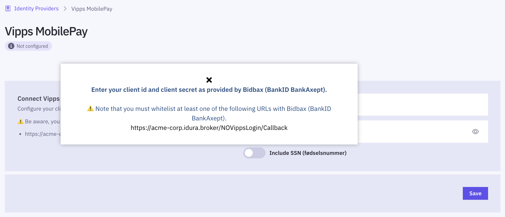

import VippsMobilepayJwtSnippet from '../../../snippets/jwt-payloads/vipps-mobilepay';

## JWT/Token example

<VippsMobilepayJwtSnippet />

## Test users

To test Vipps MobilePay, you need to install the Vipps app in a test version on your device. Follow the Vipps [guide with instructions](https://developer.vippsmobilepay.com/docs/test-environment/#test-apps) on how to set up test apps.

<Highlight icon="info">
  Creating a test user with Vipps MobilePay requires a test phone number and NIN/SSN. To request
  both, please send an email to [orders@idura.eu](mailto:orders@idura.eu) and include "Vipps
  MobilePay test credentials" in the subject line.
</Highlight>

## Available data / scopes

Username is always made available.

For applications configured to use a `static` `scope` strategy, address, email, phone and birthdate are always made available.
You can also configure your tenant so it requests SSN as well.

For applications configured to use a `dynamic` `scope` strategy, the following `scope` tokens can be supplied: `address`, `email`, `phone`, `birthdate` and `ssn` (`scope=openid phone email...`).

### Example (partial) authorize request with scopes

```text
https://YOUR_SUBDOMAIN.idura.broker/oauth2/authorize?scope=openid phone ssn&...
```

Alternatively, you can send them in the `login_hint`

```text
https://YOUR_SUBDOMAIN.idura.broker/oauth2/authorize?...&login_hint=scope:phone scope:ssn&...
```

which can be a useful if you are working with technology that does not let you control the `scope` value.

## Ordering Vipps MobilePay

To start accepting real user logins, you must **register with Vipps MobilePay as a merchant** and receive a set of secret keys (_client credentials_).

### Prerequisites for merchant registration

You must meet the following requirements to be registered as a merchant.

- Your company must be registered in your national business registry (Brønnøysundregistrene in Norway, Virk in Denmark, PRH in Finland).
- You must have a bank account in the country of registration associated with your company's organization number.
- The person signing the merchant agreement must possess a valid local eID (BankID in Norway/Sweden, MitID in Denmark, FTN in Finland).
- Before you can order the client credentials from Vipps, you will need to have created a production domain in Idura Verify as described in the [Getting ready for production guide](/verify/guides/production).
  Once you have set up the production domain, go to the [Identity sources](https://dashboard.idura.app/providers/NO_VIPPS) section and take note of the URL displayed. It must be supplied during merchant registration.



### Signing a merchant agreement

You can register as a merchant by signing an agreement at [https://vippsmobilepay.com/en-NO/online/login](https://vippsmobilepay.com/en-NO/online/login).

Please consider the notes below when filling out the registration form:

- The field labelled _"Navn på salgssted slik det vil vises for kunden i Vipps-appen"_ is to be filled out with the name that should appear in the Vipps app when a user logs in.
- In the section labelled _"Organisasjonens kontaktinformasjon"_, please enter the name and details of the person who will receive the secret keys. This person will also be granted access to the [Vipps administration portal](https://portal.vipps.no/login).

### Next steps

After you request client credentials by filling out the online agreement, your application is processed by Vipps. If you are approved, the designated contact person will receive the credentials.

Once you have received the client credentials, enter them into the Idura Verify management UI to configure your Vipps MobilePay integration.
