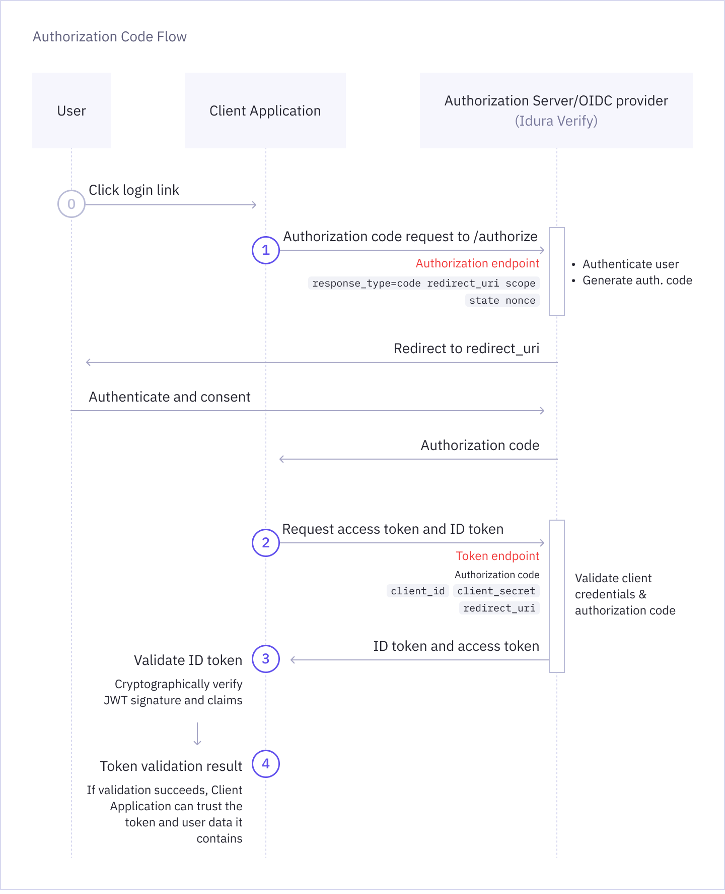

import OidcVisualizer from '../../../components/OidcVisualizer/OidcVisualizer';
import TryDemoButton from '../../../components/OidcVisualizer/components/TryDemoButton';

<TryDemoButton />

## Use this demo to understand OpenID Connect

[OpenID Connect (OIDC)](/verify/reference/glossary/#openid-connect-oidc) enables [client applications](/verify/reference/glossary/#application-client-application)
to verify the identity of the user based on authentication performed by an [Authorization Server](/verify/reference/glossary/#authorization-server).
If the authentication flow completes successfully, the client application receives an [ID Token](/verify/reference/glossary/#id-token) — a [JSON Web Token (JWT)](/verify/reference/glossary/#json-web-token-jwt) containing identity information about the user.

This visualizer lets you run the flow step by step and observe requests and responses exchanged between the **Client application**
and **Idura Verify acting as the Authorization Server**, so you can understand what happens at every step.

## Authorization Code Flow

[Authorization Code Flow](/verify/getting-started/oidc-intro/#authenticate-with-back-channel-authorization-code-flow) is the most common OIDC flow for web applications.
The diagram below shows how the Client Application and Authorization Server interact to complete this flow.

## Try the Interactive Demo

Click through the steps to act on behalf of the Client Application.

<OidcVisualizer />
