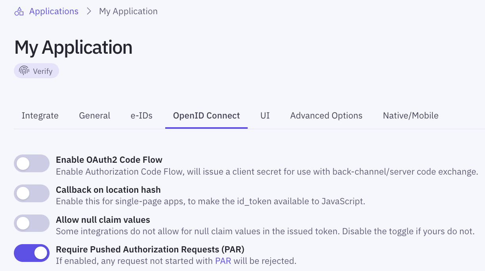

<a href="https://datatracker.ietf.org/doc/html/rfc9126" target="_blank">Pushed Authorization Requests (PAR)</a>
is an OAuth 2.0 extension that allows sending [authorization request parameters](/verify/getting-started/oidc-intro/#authorize-request-parameters) 
to the authorization server via a POST request, rather than in the browser's URL query string.

PAR enhances security by mitigating risks associated with exposing sensitive data in URLs.
It also allows the authorization server to authenticate the client and validate the request early in the process (before any user interaction occurs),
which can prevent attempts to spoof clients or otherwise tamper with or misuse an authorization request.

Using PAR improves [Telemetry & Observability](/verify/guides/telemetry/#par) for your Idura applications:
it helps you trace authorization requests by giving you a `Trace-Id` to follow immediately and directly to your backend.

PAR can be used with any [OpenID Connect flow](/verify/getting-started/oidc-intro/#supported-openid-connect-flows) that involves authorization requests sent via the browser,
including the [Authorization Code Flow](/verify/getting-started/oidc-intro/#authenticate-with-back-channel-authorization-code-flow) and the [Authorization Code Flow with PKCE](/verify/getting-started/oidc-intro/#authenticate-with-pkce).

## How PAR works

[Regular authorization requests](/verify/getting-started/glossary/#authorization-request-authorize-url) are made by redirecting the user's browser to the OAuth2 authorization endpoint (`/oauth2/authorize`) with all parameters included in the URL.

The process with PAR is slightly different:

- Your backend makes a POST request containing request parameters (_those you would otherwise include in the URL query string_) to the PAR endpoint (`/oauth2/par`).
- The authorization server responds with a `request_uri`, a unique identifier for your request.
- Your application redirects the user's browser to the authorization server's authorization endpoint, including the `request_uri` obtained from the PAR response and the application's `client_id`.
- The authorization server retrieves the original request parameters using the `request_uri` and proceeds with the authentication flow.

## Implementing PAR with Idura

You can start using PAR in place of standard authorization requests by following the steps below.

### 1: Push the authorization request from your backend

Send a POST request from your backend to the PAR endpoint. The PAR endpoint URL can be found in your
[OIDC Discovery Document](/verify/getting-started/glossary/#oidc-discovery-document-well-knownopenid-configuration) under `pushed_authorization_request_endpoint`.

Your POST request should include:

- The same parameters you would normally send in an authorization request (e.g. `response_type`, `scope`, `redirect_uri`, `state`).
  For the complete list of authorization request parameters, see [Authorize Request Parameters](/verify/getting-started/oidc-intro/#authorize-request-parameters).
- Client authentication credentials (for [confidential clients](/verify/getting-started/glossary/#confidential-client)):
  - either `client_id` and `client_secret` (included in the Basic Authorization header) or
  - `client_assertion` and `client_assertion_type` (included in the request body), when using [Private Key JWT](/verify/guides/privatekey-jwt/).
- `code_challenge` and `code_challenge_method` (for [public clients](/verify/getting-started/glossary/#public-clients) or clients implementing [Authorization Code Flow with PKCE](/verify/getting-started/oidc-intro/#authenticate-with-pkce)).

<Highlight icon="info">

The [PKCE](/verify/getting-started/glossary/#pkce-proof-key-for-code-exchange) extension to the Authorization Code Flow is required for public clients and recommended for confidential clients.
It offers stronger protection against the misuse or injection of authorization codes, making your implementation more secure.

For more details, see [OpenID Connect best security practices](/verify/getting-started/best-security-practices/verify/getting-started/best-security-practices/#authorization-code-flow).

</Highlight>

**Example PAR Request (Basic Auth):**

```http
# Replace `YOUR_DOMAIN.idura.broker` with your Idura domain
# Replace `$client_id` and `$client_secret` with the client credentials of your Idura Application
# Replace `$your_return_url` with the redirect URI registered in your Idura application

POST https://YOUR_DOMAIN.idura.broker/oauth2/par HTTP/1.1
Authorization: Basic $base64_$client_id:$client_secret
Content-Type: application/x-www-form-urlencoded
client_id=$client_id&
response_type=code&
scope=openid%20profile&
redirect_uri=$your_return_url&
state=abc456
```

**Example PAR Request (Private Key JWT):**

```http
# Replace `YOUR_DOMAIN.idura.broker` with your Idura domain
# Replace $client_id with the Client ID of your Idura Application
# Replace `$client_assertion` with your JWT assertion
# Replace `$your_return_url` with the redirect URI registered in your Idura application

POST https://YOUR_DOMAIN.idura.broker/oauth2/par HTTP/1.1
Content-Type: application/x-www-form-urlencoded
client_id=$client_id&
client_assertion_type=urn%3Aietf%3Aparams%3Aoauth%3Aclient-assertion-type%3Ajwt-bearer&
client_assertion=$client_assertion&
response_type=code&
scope=openid%20profile&
redirect_uri=$your_return_url&
state=abc456
```

**Example PAR Request (PKCE):**

```http
# Replace `YOUR_DOMAIN.idura.broker` with your Idura domain
# Replace $client_id with the Client ID of your Idura Application
# Replace `$your_return_url` with the redirect URI registered in your Idura application

POST https://YOUR_DOMAIN.idura.broker/oauth2/par HTTP/1.1
Content-Type: application/x-www-form-urlencoded
client_id=$client_id&
code_challenge=E9Melhoa2OwvFrEMTJguCHaoeK1t8URWbuGJSstw-cM&
code_challenge_method=S256&
response_type=code&
scope=openid%20profile&
redirect_uri=$your_return_url&
state=abc456
```

**Successful Response:**

```http
HTTP/1.1 201 Created
Content-Type: application/json
{
  "request_uri": "urn:ietf:params:oauth:request_uri:69091cba-850f-4e7d-9c37-b5c6a74e0e02",
  "expires_in": 120
}
```

The response contains:

`request_uri`: the identifier of the authorization request pushed by the client application.
`expires_in`: the lifetime of the `request_uri` in seconds.

### 2: Redirect the user to the authorization endpoint

After receiving the `request_uri`, redirect the user's browser to the authorization endpoint. Only `client_id` and `request_uri` parameters must be included in the authorization request.

**Example Authorization Request:**

```http
GET https://{{YOUR_IDURA_DOMAIN}}/oauth2/authorize?client_id=your_idura_application_client_id&request_uri=urn:ietf:params:oauth:request_uri:69091cba-850f-4e7d-9c37-b5c6a74e0e02
```

The authorization server uses the `request_uri` to retrieve the original request parameters.
The rest of the authentication flow then proceeds as usual.

### 3: Enforce PAR (_optional_)

You can enforce PAR by toggling **Require Pushed Authorization Requests (PAR)** in your application's **OpenID Connect** settings in the <a href="https://dashboard.idura.app" target="_blank">Idura Dashboard</a>.



#### Why enforce PAR?

Enforcing PAR improves security by preventing attackers from starting requests. Otherwise, even if you use PAR yourself, an attacker could still use regular authorization requests.
