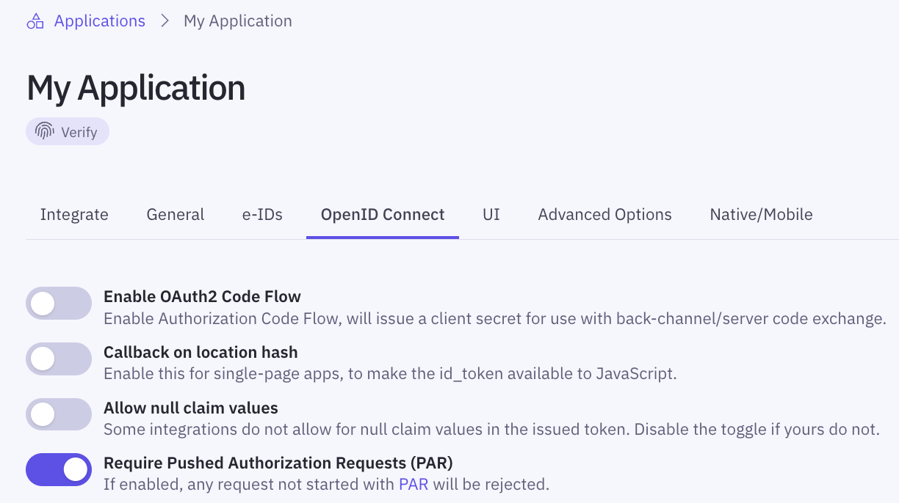

<a href="https://datatracker.ietf.org/doc/html/rfc9126" target="_blank">
  Pushed Authorization Requests (PAR)
</a>
is an OAuth 2.0 extension that allows sending [authorization request
parameters](/verify/getting-started/oidc-intro/#authorize-request-parameters) to the authorization
server via a POST request, rather than in the browser's URL query string.

PAR enhances security by mitigating risks associated with exposing sensitive data in URLs.
It also allows the authorization server to authenticate the client and validate the request early in the process (before any user interaction occurs),
which can prevent attempts to spoof clients or otherwise tamper with or misuse an authorization request.

Using PAR improves [Telemetry & Observability](/verify/guides/telemetry/#par) for your Idura applications, helping you trace authorization requests.

PAR can be used with any [OpenID Connect flow](/verify/getting-started/oidc-intro/#supported-openid-connect-flows) that involves authorization requests,
including the [Authorization Code Flow](/verify/getting-started/oidc-intro/#authenticate-with-back-channel-authorization-code-flow) and the [Authorization Code Flow with PKCE](/verify/getting-started/oidc-intro/#authenticate-with-pkce).

## How PAR works

[Regular authorization requests](/verify/getting-started/glossary/#authorization-request-authorize-url) are made by redirecting the user's browser to the OAuth2 authorization endpoint (`/oauth2/authorize`) with all parameters included in the URL.

The process with PAR is slightly different:

- Your backend makes a POST request containing request parameters (_those you would otherwise include in the URL query string_) to the PAR endpoint (`/oauth2/par`).
- The authorization server responds with a `request_uri`, a unique identifier for your request.
- Your application redirects the user's browser to the authorization server's authorization endpoint, including the `request_uri` obtained from the PAR response.
- The authorization server retrieves the original request parameters using the `request_uri` and proceeds with the authentication flow.

## Implementing PAR with Idura

To enable PAR, toggle **Require Pushed Authorization Requests (PAR)** in your application's OpenID Connect settings in the <a href="https://dashboard.criipto.com" target="_blank">Idura Dashboard</a>.



<br />

After enabling PAR, follow the two steps below.

### Step 1: Push the authorization request from your backend

Send a POST request from your backend to the PAR endpoint. The PAR endpoint URL can be found in your
[OIDC Discovery Document](/verify/getting-started/glossary/#oidc-discovery-document-well-knownopenid-configuration) under `pushed_authorization_request_endpoint`.

The POST body must include:

- the same parameters you would normally send in an authorization request (e.g., `response_type`, `scope`, `redirect_uri`, `state`, etc.).
  For the complete list of authorization request parameters, see [Authorize Request Parameters](/verify/getting-started/oidc-intro/#authorize-request-parameters).
- client authentication credentials:
  - either `client_secret`, or
  - `client_assertion` + `client_assertion_type` when using [Private Key JWT](/verify/guides/privatekey-jwt/)

**Example PAR Request:**

```sh
# Replace `YOUR_DOMAIN.idura.broker` with your Idura domain
# Replace `$client_assertion` with your JWT assertion
# Replace `$your_return_url` with the redirect URI registered in your Idura application

POST https://YOUR_DOMAIN.idura.broker/oauth2/par HTTP/1.1
Content-Type: application/x-www-form-urlencoded
client_id=your_idura_application_client_id&
client_assertion_type=urn%3Aietf%3Aparams%3Aoauth%3Aclient-assertion-type%3Ajwt-bearer&
client_assertion=$client_assertion&
response_type=code&
scope=openid%20profile&
redirect_uri=$your_return_url&
state=abc456&
```

**Successful Response:**

```sh
HTTP/1.1 201 Created
Content-Type: application/json
{
  "request_uri": "urn:ietf:params:oauth:request_uri:69091cba-850f-4e7d-9c37-b5c6a74e0e02",
  "expires_in": 120
}
```

The response contains:

`request_uri`: the identifier of the authorization request pushed by the client application.
`expires_in`: the lifetime of the `request_uri` in seconds.

### Step 2: Redirect the user to the authorization endpoint

After receiving the `request_uri`, redirect the user's browser to the authorization endpoint. Only `client_id` and `request_uri` need to be included as parameters.

**Example Authorization Request:**

```sh
GET https://{{YOUR_IDURA_DOMAIN}}/oauth2/authorize?client_id=your_idura_application_client_id&request_uri=urn:ietf:params:oauth:request_uri:69091cba-850f-4e7d-9c37-b5c6a74e0e02
```
